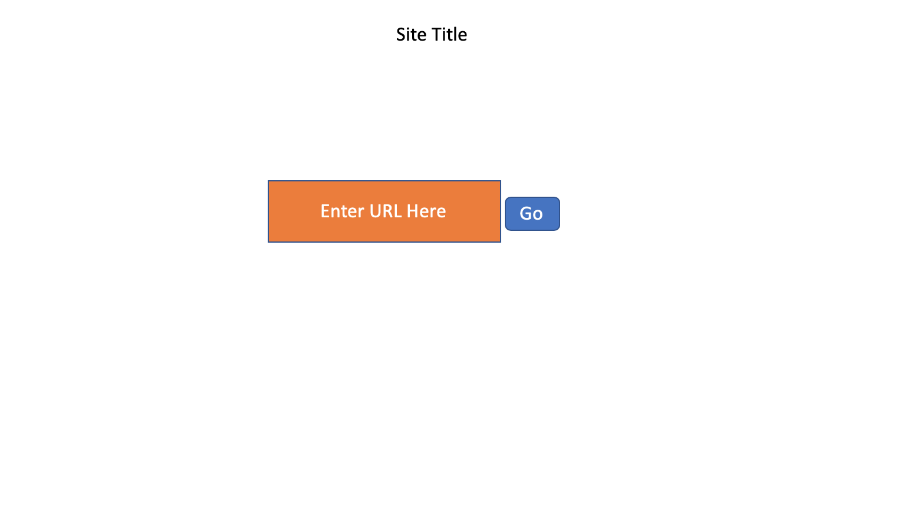
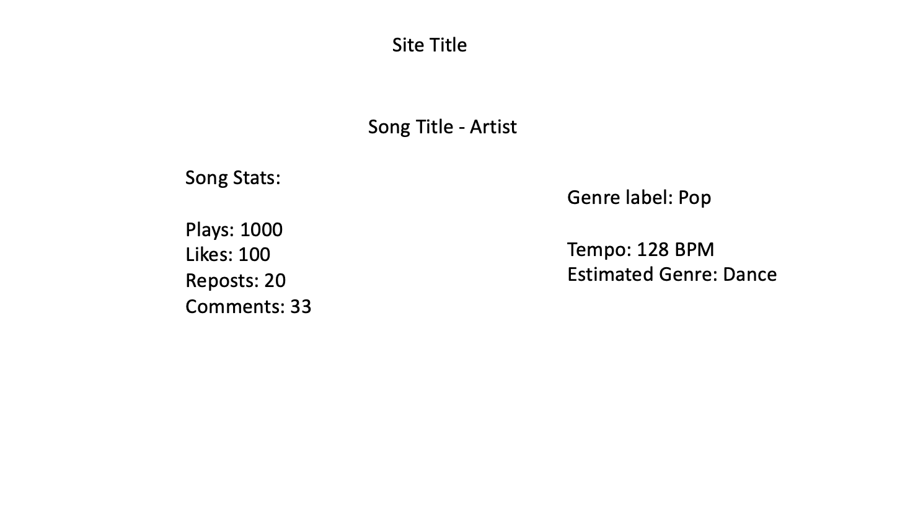
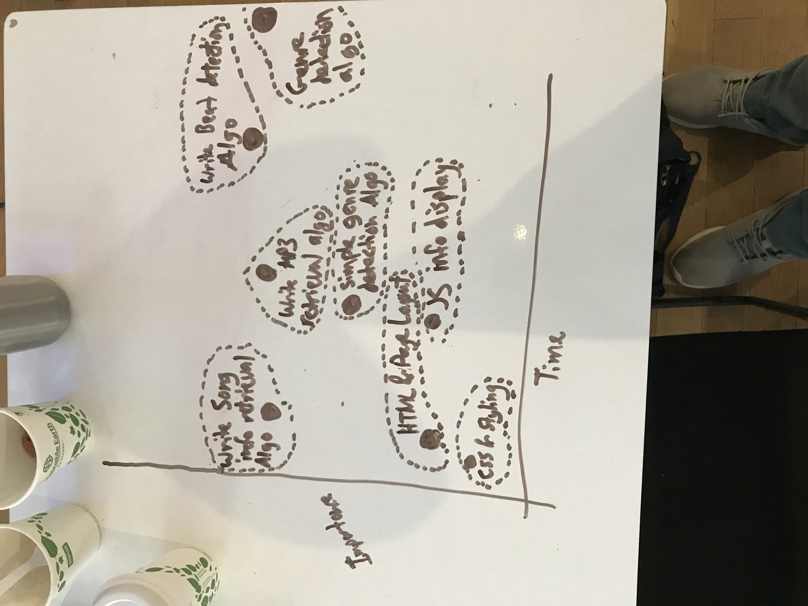
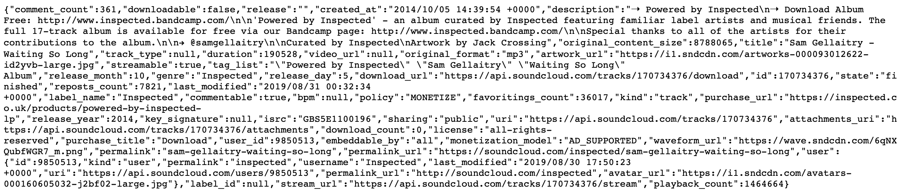

# Audio-Analysis-Beat-and-Genre-Detection
This project takes SoundCloud songs (via URL) and returns a BPM using soundwave analysis

DESCRIPTION
- user will be able to enter the url of a song of their choice (into an input box)
- URL will query the song information via string manipulation to yield a viable api call
    - through this I will save info locally and retrieve audio file
    -  https://developers.soundcloud.com/docs/api/reference#tracks
- the audio will be analyzed using a beat detection algorithm, which will output a BPM
- BPM will be displayed alongside the song information

WIREFRAME

PRIORITY MATRIX

API SAMPLE

MVP
- website with aesthetic formatting
- submit button for soundcloud url
- Beat detection algorithm working
    - pulls audio from soundcloud song provided in url
    - analyzes an audio sample
    - determines BPM
    - returns BPM

PMVP
- Genre detection
- Check if genre is real
- Genre change if BPM does not reflect labeled genre

TIMELINE

| Component        | Priority | Estimated Time | Time Invested | Time ∆   |
| :-------------:  | :------: | :------------: | :-----------: | :------: |
| HTML Design      |    L     |    30 Min      |    20 min     | -10 min  |
| CSS Structuring  |    L     |    30 Min      |    15 min     | |
| JS for base site |    L     |    30 Min      |     0 min     | |
| Pull MP3 - algo  |    H     |   120 Min      |   355 min     | |
| Analyze BPM algo |    H     |   360 Min      |   165 min     | |
| Genre label algo |    L     |   120 Min      |     0 min     | |
| Genre BPM algo   |    L     |    90 Min      |     0 min     | |